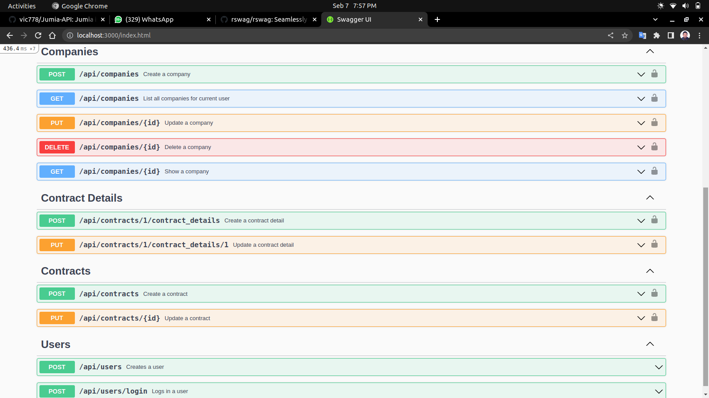

# DEEL

> [Deel](https://app.deel.com/) is a global payroll solution that helps businesses hire anyone, anywhere. Using a tech-enabled self serve process, you can now hire independent contractors or full-time employees in over 150 countries, compliantly and in minutes. I liked the professionalism of their site and wanted to clone the backend to implement my Rails skills. It also allows only an admin to create, read, update and delete actions. This API is made these models:

  still in progress...

### Deployment

## Built With

- Rails
- Ruby 
- Postgresql
- Devise
- JWT
- ActiveRecord Serializer
- ActiveAdmin
- ActiveRecord Image Uploader
- Cloudinary
- Heroku

## Getting Started

Here are the steps to follow in order to get this project on your local computer.

### Prerequisites

`rails v7.0.2 +`

`ruby v3.0.2 +`

### Setup

clone this repo by typing `git clone https://github.com/vic778/Jumia-API`

### Install

install the dependencies by typing `bundle install`

### Usage

start the local server by running `rails s`

### Testing

run the tests by typing `bundle exec rspec`

### Documentation

## Author

👤 **Victor Barh**

- GitHub: [@Vvic778](https://github.com/vic778)
- Twitter: [@victoirBarh](https://twitter.com/)
- LinkedIn: [LinkedIn](https://linkedin.com/in/victoir-barh)

## 🤝 Contributing

Contributions, issues and feature requests are welcome!

Feel free to check the [issues page](issues/).

## Show your support

Give a ⭐️ if you like this project!

## Acknowledgments

 N/A

## 📝 License

This project is [MIT](lic.url) licensed.
